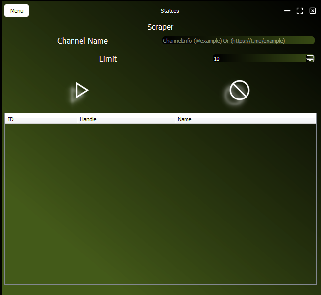
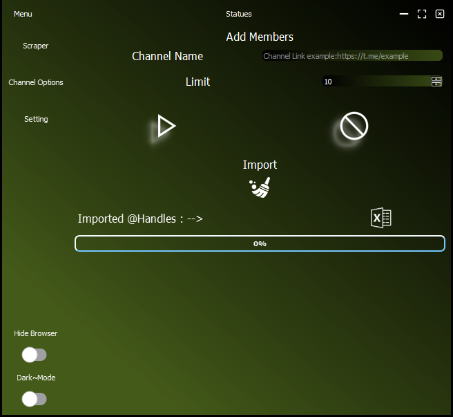
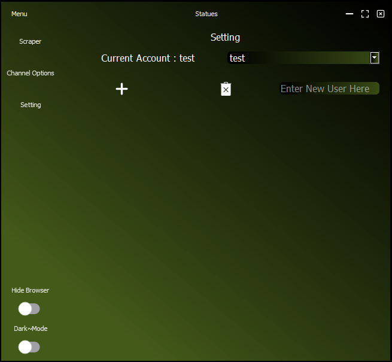

# Telegram
TelegramApp to scrape Handles from groups and add them to your channel 

 

 

 

## Pages

* Scraper --> To Scrape Handles From Telegram Group 
* Channel Option --> To Add Members To Your Channel
* Setting --> To Manage Accounts and Add New User Or delete old one

## Built With

* Python
* Telethon API
* PyroGram API
* Selenium 

## Frameworks 
* [PyQt5](https://doc.qt.io/qtforpython/)   For Build GUI 
* [Selenium](https://www.selenium.dev/)     For WebAutomation
* [PyroGram](https://pyrogram.org/)         For Telegram Adding Methods  

